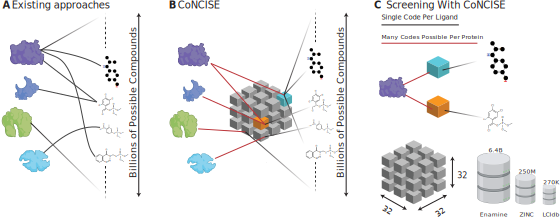

<a id="readme-top"></a>


<!-- PROJECT SHIELDS -->
<!--
*** I'm using markdown "reference style" links for readability.
*** Reference links are enclosed in brackets [ ] instead of parentheses ( ).
*** See the bottom of this document for the declaration of the reference variables
*** for contributors-url, forks-url, etc. This is an optional, concise syntax you may use.
*** https://www.markdownguide.org/basic-syntax/#reference-style-links
-->

[![Stargazers][stars-shield]][stars-url]
[![Issues][issues-shield]][issues-url]
[![MIT License][license-shield]][license-url]


<!-- PROJECT LOGO -->
<br />
<div align="center">
  <a href="https://github.com/rohitsinghlab/CoNCISE">
    
  </a>

<h3 align="center">CoNCISE</h3>

  <p align="center">
    Learning a CoNCISE language for small-molecule binding.
  </p>
  <p align="justify">
  Rapid advances in deep learning have improved in silico methods for drug-target interac-tion (DTI) prediction. However, current methods do not scale to the massive catalogs that list millions or billions of commercially-available small molecules. Here, we introduce CoNCISE, a method that accelerates drug-target interaction (DTI) prediction by 2-3 orders of magnitude while maintaining high accuracy. CoNCISE uses a novel vector-quantized codebook approach and a residual-learning based training of hierarchical codes.Our DTI architecture, which combines these compact ligand representations with fixed-length protein embeddings in a cross-attention framework, achieves state-of-the-art prediction accuracy at unprecedented speed. 
  </p>
</div>



<!-- TABLE OF CONTENTS -->
<details>
  <summary>Table of Contents</summary>
  <ol>
    <li>
      <a href="#getting-started">Getting Started</a>
      <ul>
        <li><a href="#installation">Installation</a></li>
      </ul>
    </li>
    <li><a href="#usage">Usage</a></li>
    <li><a href="#license">License</a></li>
    <li><a href="#contact">Contact</a></li>
  </ol>
</details>


<!-- GETTING STARTED -->
## Getting Started

Currently CoNCISE is in closed access and does not have a pip wheel. We suggest installing it in a clean python environment with python >= 3.12.


### Installation

```
pip install concise
```


Install from source

```bash
pip install .
```

<p align="right">(<a href="#readme-top">back to top</a>)</p>

<!-- USAGE EXAMPLES -->
## Usage

CoNCISE achieves extremely fast Drug-Target Interaction (DTI) prediction by discretizing the vast space of small molecules into $32^3 = 32768$ discrete, hierarchically organized codes representation, requiring only the SMILES molecular representation as input in the process. 
The CoNCISE DTI pipeline consists of the following three steps:
1. Use CoNCISE ligand module to convert the ligand SMILES representation to discrete codes.
2. Take any protein and find its binding affinity against all $32^3$ possible codes (figure 2 above).
3. Use 2 and 3 to find protein-drug pairs with high binding affinity.

All these three steps can be done through the single `easy_query` option, which can be invoked using the following command
```bash
concise easy_query --config-path configs/easy_query.yaml
```

The arguments to the `easy_query` option is stored in a yaml file, whose contents are described below:
```
# 1. fasta_file: the path to the fasta file
fasta_file: data/SwissProtMini/seqs.fasta
# 2. rec_embed_file: the path to create/load the receptor embeddings
rec_embed_file: data/SwissProtMini/receptors.h5
# 3. ligand_file: the path to the ligand file
ligand_file: data/DrugsMini/smiles.csv
# 4. lig_embed_file: the path to create/load ligand embeddings
lig_embed_file: data/DrugsMini/ligands.h5
# 5. save location 
save_path: data/QueryDrugsMini/scores.csv
# 6. Search Parameters
num_codes_per_protein: 10
num_smiles_per_code: 20
# 7. device: the device to run the model on
device:
  _target_: torch.device
  device: 0


## HYDRA configurations. IGNORE
protein_dataset:
  rec_embed_file: ${..rec_embed_file}
  fasta_file: ${..fasta_file}
  protein_dataset:
    _target_: concise.dataset.ScoreFastaDataset
    fasta_file: ${..fasta_file}
    rec_embed_file: ${..rec_embed_file}
    max_entries: -1
  protein_dataloader:
    _target_: torch.utils.data.DataLoader
    dataset: ${..protein_dataset}
    batch_size: 1
    num_workers: 2
    shuffle: false

ligand_dataset:
  lig_embed_file: ${..lig_embed_file}
  ligand_dataset:
    _target_: concise.dataset.LigandDataset
    lig_file: ${ligand_file}
    lig_embed_file: ${..lig_embed_file}
  ligand_dataloader:
    _target_: torch.utils.data.DataLoader
    dataset: ${..ligand_dataset}
    batch_size: 32
    num_workers: 4
    shuffle: false
```


**Data Availability and Download** 

The relevent datasetes are provided in the `data` folder. Additionally, they could also be downloaded using the option:
```
concise download [DOWNLOAD_PATH]
```

*Note: this is only reccomended if you don't intend on repeated queries as intermediate results are not saved.*

___

### Advanced Usage

The tree steps in the CoNCISE pipeline could also be separately performed using the addtional options included in the CoNCISE package. We describe them in order below.

1. Converting SMILES to Codes using `smiles_to_codes`
   
   `smiles_to_codes` requires a configuration file specifying the location of the SMILES csv file to produce the discretized code representation. Given a configuration file, [configs/smiles_to_codes.yaml](configs/smiles_to_codes.yaml), we can invoke this API the following way:
   ```
   concise smiles_to_codes --config-path configs/smiles_to_codes.yaml
   ```

   <details>
   <summary>Example smiles_to_codes configuration</summary>

   ```yaml
   ## configs/smiles_to_codes.yaml
   ## Parameters to change
   
   # 1. Working directory
   prefix: data/DrugsMini             # the folder where the input, output and the intermediate h5py files are stored,
   
   # 2. the ligand CSV file. Should be comma separated and contain at least the header `smiles`
   # corresponding to the SMILES molecular representation. 
   ligand_file: ${prefix}/smiles.csv 

   # 3. output CSV location
   save_path: ${prefix}/codes.csv

   # 4. option to save as a SQLITE file.
   save_as_sqlite: True
   
   device:
     _target_: torch.device
     device: 0                        # SPECIFY the device
   
   ## HYDRA component. IGNORE
   dataset:
     lig_embed_file: ${..prefix}/ligands.h5
     ligand_dataset:
       _target_: concise.dataset.LigandDataset
       lig_file: ${ligand_file}
       lig_embed_file: ${..lig_embed_file}
     ligand_dataloader:
       _target_: torch.utils.data.DataLoader
       dataset: ${..ligand_dataset}
       batch_size: 32
       num_workers: 4
       shuffle: false
   ```
   </details>

2. Assigning proteins to code:

   Since the ligand space has been discretized into a small set of possible hierarchical codes, it is now feasible to predict the binding affinity of a protein
   with all possible code combinations. This is accomplished using the `protein_code_assignment` option.

   Given a configuration file [configs/protein_to_codes.yaml](configs/protein_to_codes.yaml) specifying the protein and other auxiliary information, we can obtain the code binding probabilities
   of the protein using the following command:
     
   ```
   concise protein_code_assignment --config-path configs/protein_to_codes.yaml
   ```

   <details>
   <summary>Example protein_to_codes configuration</summary>

   ```yaml
   ## configs/protein_to_codes.yaml
    
   ## Parameters to change

   # 1. prefix: the path where data is stored
   prefix: data/SwissProtMini
    
   # 2. fasta_file: the path to the FASTA file. Can accept more than one protein in the FASTA record
   fasta_file: ${prefix}/seqs.fasta

   # 3. save location 
   save_path: ${prefix}/scores.csv
    
   device:
     _target_: torch.device
     device: cpu                 # specify the device. CUDA devices recommended for faster operation
    
    
   ## HYDRA component. IGNORE.
   dataset:
     rec_embed_file: ${..prefix}/receptors.h5
     fasta_file: ${..fasta_file}
     protein_dataset:
       _target_: concise.dataset.ScoreFastaDataset
       fasta_file: ${..fasta_file}
       rec_embed_file: ${..rec_embed_file}
       max_entries: -1
     protein_dataloader:
       _target_: torch.utils.data.DataLoader
       dataset: ${..protein_dataset}
       batch_size: 1
       num_workers: 16
       shuffle: false
   ```
   </details>
    
3. Querying protein with smiles.
   After the binding codes have been identified for each protein (using the `protein_to_codes` option), we can now associate each protein with the highest binding
   SMILES corresponding to the top-binding codes. This step requires that steps 1 and 2 have already been successfully performed. 

   (**Caution** the query example assumes steps 1. and 2. have already been performed)

   Given the configuration file pointing to the protein-to-code and smiles-to-codes assignment files, we can query the most likely protein-ligand
   binding parters using the following command:
   
   ```
   concise query --config-path configs/query.yaml
   ```

   <details>
   <summary>Example query configuration</summary>

   ```yaml
   ## configs/query.yaml
   
   # 1. the codes SQLITE file, that assigns discrete codes to ligands, obtained using the `smiles_to_codes` option
   codes_file: data/DrugsMini/codes.sqlite
   # 2. the protein-ligand binding file, obtained using the `proteins_to_codes` option
   protein_scores_file: data/SwissProtMini/scores.csv
   # 3. Save URL
   save_path: ${prefix}/assignments.csv
     
   ## Search Parameters
   # maximum number of codes assigned to protein 
   num_codes_per_protein: 10
   # maximum number of SMILES, that we randomly select from the particular CODE assignment
   num_smiles_per_code: 20
   ```
   </details>

**Note** that all commands have accompanying example configurations in `data/` with the same name as the command. They can be used as reference for custom configurations.

<p align="right">(<a href="#readme-top">back to top</a>)</p>

___

<!-- LICENSE -->
## License
The copyrights of this software are owned by Tufts and Duke Universities. Two licenses for this software are offered:

1. An open-source license under the CC-BY-NC-SA 4.0 license for non-commercial academic use.

2. A custom license with the two universities, for commercial use or uses without the CC-BY-NC-SA 4.0 license restrictions. 

As a recipient of this software, you may choose which license to receive the code under.

To enter a custom license agreement without the CC-BY-NC-SA 4.0 license restrictions, please contact the Digital Innovations department at the Duke Office for Translation & Commercialization (OTC) (https://otc.duke.edu/digital-innovations/#DI-team) at otcquestions@duke.edu.

Please note that this software is distributed AS IS, WITHOUT ANY WARRANTY; and without the implied warranty of MERCHANTABILITY or FITNESS FOR A PARTICULAR PURPOSE.


<p align="right">(<a href="#readme-top">back to top</a>)</p>


<!-- CONTACT -->
## Contact

<a href="https://github.com/rohitsinghlab/CoNCISE/graphs/contributors">
  
</a>


<!-- MARKDOWN LINKS & IMAGES -->
<!-- https://www.markdownguide.org/basic-syntax/#reference-style-links -->
[forks-shield]: https://img.shields.io/github/forks/rohitsinghlab/CoNCISE.svg?style=for-the-badge
[forks-url]: https://github.com/rohitsinghlab/CoNCISE/network/members
[stars-shield]: https://img.shields.io/github/stars/rohitsinghlab/CoNCISE.svg?style=for-the-badge
[stars-url]: https://github.com/rohitsinghlab/CoNCISE/stargazers
[issues-shield]: https://img.shields.io/github/issues/rohitsinghlab/CoNCISE.svg?style=for-the-badge
[issues-url]: https://github.com/rohitsinghlab/CoNCISE/issues
[license-shield]: https://img.shields.io/github/license/rohitsinghlab/CoNCISE.svg?style=for-the-badge
[license-url]: https://github.com/rohitsinghlab/CoNCISE/blob/master/LICENSE
